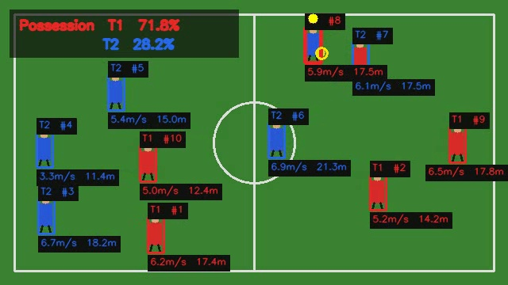

# MatchTrace CV

MatchTrace CV is a football-video analysis reference implementation. It
tracks players, classifies teams, estimates possession and movement, and writes
an annotated video. The repository also includes a small training pipeline,
evaluation, model export, a CLI, and a FastAPI endpoint.

The default example uses generated data. It runs offline and does not require
private footage or model weights.



## What It Does

- Seeded synthetic dataset and football-video generator
- Compact CNN trained from scratch for jersey-team classification
- Detector protocol with offline color and optional Ultralytics backends
- Streaming frame processing with bounded video memory
- Motion-and-IoU multi-object tracking with occlusion recovery
- Batched CNN inference and confidence-weighted team voting
- Camera-motion compensation and metric pitch projection
- Stabilized possession, speed, and cumulative-distance analytics
- FastAPI service with path traversal protection
- Saliency-map explainability and TorchScript export
- Run summaries with artifact hashes and structured JSON logs
- CPU unit and end-to-end tests

## Quick Start

```bash
python -m venv .venv
```

Activate the environment, then install:

```bash
python -m pip install --upgrade pip
pip install -e .
```

Run the offline example:

```bash
matchtrace demo
```

This generates a dataset and short match video, trains and evaluates the team
classifier, analyzes the video, and exports the model.

Expected outputs:

```text
artifacts/data/team_dataset.npz
artifacts/data/demo_match.mp4
artifacts/models/team_classifier.pt
artifacts/models/team_classifier.torchscript.pt
artifacts/reports/evaluation.json
outputs/analyzed_demo.mp4
outputs/run_summary.json
```

## Workflow

```bash
matchtrace generate-data
matchtrace train
matchtrace evaluate
matchtrace analyze
matchtrace export
```

See [Training](docs/TRAINING.md) and [Inference](docs/INFERENCE.md) for details.
Release history is in [CHANGELOG.md](CHANGELOG.md).

## Architecture

```text
matchtrace-cv/
|-- app/                         FastAPI entry point
|-- configs/                     TOML configuration
|-- docs/                        PRD and engineering guides
|-- src/matchtrace/
|   |-- data/                    Synthetic datasets and demo video
|   |-- evaluation/              Metrics and held-out evaluation
|   |-- inference/               Detection, tracking, geometry, analytics
|   |-- models/                  CNN, loading, export, explainability
|   |-- training/                Seeded optimization loop
|   |-- utils/                   Config, logging, seeds, video streams
|   |-- cli.py                   Command-line interface
|   `-- service.py               API application factory
|-- tests/                       Unit and end-to-end tests
|-- ATTRIBUTION.md
|-- LICENSE
|-- pyproject.toml
`-- requirements.txt
```

See [ARCHITECTURE.md](docs/ARCHITECTURE.md) for component boundaries and
[DEVELOPMENT.md](DEVELOPMENT.md) for tradeoffs and project provenance.

Pull requests run the test suite through
[GitHub Actions](.github/workflows/ci.yml).

## Real Video

Install the optional detector:

```bash
pip install -e ".[real-video]"
```

Set `detector.backend = "ultralytics"` in a copied TOML configuration and set
an approved model path:

```powershell
$env:MATCHTRACE_MODEL_PATH = "C:\models\football-detector.pt"
matchtrace --config configs/production.toml analyze --input input.mp4
```

The model must expose `player` or `goalkeeper`, and `ball` class names.
Real-footage accuracy must be evaluated on a licensed representative dataset.

## REST API

```bash
matchtrace serve --host 127.0.0.1 --port 8000
```

Endpoints:

- `GET /health`
- `POST /analyze`

The analyze endpoint accepts file names inside the configured API input and
output roots. It deliberately rejects arbitrary filesystem paths.

## Testing

```bash
python -m unittest discover -s tests -v
```

Nine tests cover deterministic dataset loading, training quality, held-out
evaluation, inference frame integrity, API path validation, motion recovery,
artifact-path separation, batched inference, temporal possession, jump
rejection, analyzer reuse, and fingerprints.

## Performance

On the verification CPU, the synthetic classifier achieved 100% held-out
accuracy and the 640x360, 120-frame demo ran at 69.3 FPS. This is an integration
benchmark, not a real-match accuracy result.

## Configuration

All paths, seeds, dataset sizes, optimizer settings, detector choices, tracker
weights, temporal thresholds, audit hashes, pitch dimensions, and rendering
options live in
[`configs/default.toml`](configs/default.toml).

## Security And Privacy

- Do not commit private match footage or proprietary weights.
- Use only trusted model files.
- Keep the API roots narrow and run video jobs in isolated workers.
- Review dependency and model licenses before distribution.
- Report vulnerabilities using [SECURITY.md](SECURITY.md).

## Attribution

The functional scope was informed by the adjacent football-analysis project.
See [ATTRIBUTION.md](ATTRIBUTION.md) and [DEVELOPMENT.md](DEVELOPMENT.md).

## License

MatchTrace CV's new source code is available under the MIT License. Optional
dependencies, detector weights, datasets, and processed media retain their own
terms.
