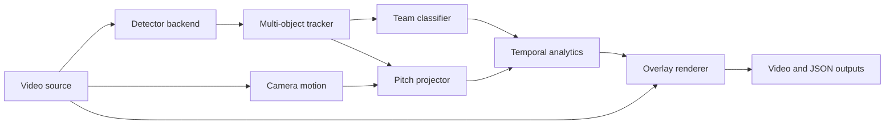

# Architecture

## Design Principles

- Stream frames to keep memory bounded by frame size.
- Keep model adapters behind protocols.
- Keep analytics independent from rendering and video I/O.
- Make every path and threshold configurable.
- Use typed records at module boundaries.
- Make the default demonstration reproducible and offline.

## Component Flow



## Repository Boundaries

```text
src/matchtrace/
|-- data/          synthetic data and video generation
|-- models/        trainable model definitions and checkpoint loading
|-- training/      deterministic optimization workflow
|-- evaluation/    metrics and held-out evaluation
|-- inference/     detectors, tracking, geometry, analytics, pipeline
`-- utils/         configuration, logging, seeding, and video I/O

configs/           environment-neutral TOML configuration
tests/             unit and end-to-end behavior tests
app/               FastAPI application factory
docs/              PRD, architecture, and operational guides
```

## Extensibility

`Detector` is a protocol. The bundled color detector makes the demo independent
of model downloads, while `UltralyticsDetector` enables approved production
weights without changing tracking or analytics.

The team classifier checkpoint includes class names and preprocessing metadata.
Inference batches all eligible crops in a frame and aggregates
confidence-weighted predictions per track to reduce frame-level noise.

`MotionAwareTracker` predicts positions from track velocity and combines
normalized distance with bounding-box overlap. It can reconnect an identity
after a short missed-detection interval without adding a heavy tracking
dependency.

`PitchProjector` owns image-to-pitch calibration. Consumers receive metric
coordinates and do not need to know whether projection is identity-scaled or
homography-based.

`AnalyticsEngine` smooths projected positions, rejects physically impossible
jumps, and applies possession hold and switch hysteresis. Each run summary
includes quality counters and optional SHA-256 fingerprints for the
configuration, model, input, and output.

## Operational Model

The CLI runs synchronous local jobs. The API validates paths against configured
input and output roots and delegates to the same pipeline. A production
deployment can replace synchronous execution with a queue without changing the
core package.
